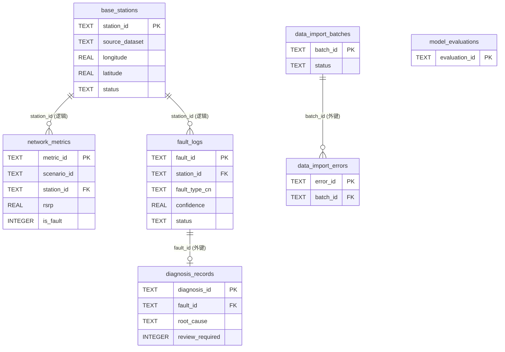

# 数据库设计说明

> 本文档对齐 `backend/src/database/schema.sql`（运行态 SQLite，`backend/data/app.db`），
> 描述全部 7 张表的字段、类型、主外键、索引与实体关系，供课程报告"数据库设计"章节引用。
> 数据写入统一经仓储层 `backend/src/database/repository.py`，API 不直接拼接 SQL。

## 1. 表总览

| 表 | 用途 | 主键 |
| --- | --- | --- |
| `base_stations` | 基站/小区工参（位置、姿态、功率、状态） | `station_id` |
| `network_metrics` | 运行指标采样记录（KPI + 故障标签） | `metric_id` |
| `fault_logs` | 故障检测/分类/定位结果与处理状态 | `fault_id` |
| `diagnosis_records` | 诊断建议（根因/动作/影响/复核） | `diagnosis_id` |
| `model_evaluations` | 模型评估指标快照 | `evaluation_id` |
| `data_import_batches` | 外部 CSV 导入批次记录 | `batch_id` |
| `data_import_errors` | 导入逐行错误记录 | `error_id` |

## 2. 实体关系（E-R）

关系说明：
- **强外键（schema 强制）**：`diagnosis_records.fault_id → fault_logs.fault_id`、
  `data_import_errors.batch_id → data_import_batches.batch_id`。
- **逻辑关联（未在 SQLite 强制，靠业务保证）**：`network_metrics.station_id` 与
  `fault_logs.station_id` 关联 `base_stations.station_id`；`network_metrics` 与
  `fault_logs` 通过 `scenario_id` 归属同一场景。
- `model_evaluations` 为独立快照表，不与业务表强关联。

## 3. 表结构明细

### 3.1 `base_stations` — 基站工参

| 字段 | 类型 | 约束 | 说明 |
| --- | --- | --- | --- |
| `station_id` | TEXT | PK | 基站唯一标识 |
| `source_dataset` | TEXT | NOT NULL | 数据来源（TelecomTS/Kaggle/Synthetic/外部导入） |
| `gnodeb_id` | TEXT | | gNodeB 标识 |
| `cell_id` | TEXT | | 小区标识 |
| `pci` | TEXT | | 物理小区识别码 |
| `longitude` / `latitude` | REAL | | 经纬度 |
| `height` | REAL | | 天线挂高 (m) |
| `azimuth` | REAL | | 方位角 (°) |
| `downtilt` | REAL | | 下倾角 (°) |
| `tx_power` | REAL | | 发射功率 (dBm) |
| `status` | TEXT | | 运行状态 |

### 3.2 `network_metrics` — 运行指标采样

| 字段 | 类型 | 约束 | 说明 |
| --- | --- | --- | --- |
| `metric_id` | TEXT | PK | 采样唯一标识 |
| `source_dataset` | TEXT | NOT NULL | 数据来源 |
| `scenario_id` | TEXT | NOT NULL | 场景标识（评估按此分组切分） |
| `timestamp` | TEXT | | 采样时间 |
| `station_id` / `cell_id` | TEXT | | 所属基站/小区（逻辑关联 base_stations） |
| `longitude` / `latitude` | REAL | | 采样点位置 |
| `rsrp` | REAL | | 参考信号接收功率 (dBm) |
| `sinr` | REAL | | 信干噪比 (dB) |
| `ber` | REAL | | 误码率 |
| `bler_dl` / `bler_ul` | REAL | | 下行/上行误块率 |
| `bandwidth_usage` | REAL | | 带宽占用率 (%) |
| `rb_num` | REAL | | 资源块数 |
| `throughput_mbps` | REAL | | 吞吐量 (Mbps) |
| `traffic_bytes` | REAL | | 流量 (bytes) |
| `packet_count` | REAL | | 包数 |
| `mcs` | REAL | | 调制编码方案等级 |
| `fault_type_raw` | TEXT | | 原始故障标签 |
| `fault_type_cn` | TEXT | | 中文故障类型（分类目标） |
| `is_fault` | INTEGER | | 是否异常 0/1（异常检测目标） |

### 3.3 `fault_logs` — 故障日志

| 字段 | 类型 | 约束 | 说明 |
| --- | --- | --- | --- |
| `fault_id` | TEXT | PK | 故障唯一标识（AI 推理写入用 `AI_` 前缀） |
| `source_dataset` | TEXT | NOT NULL | 数据来源 |
| `scenario_id` | TEXT | NOT NULL | 场景标识 |
| `station_id` | TEXT | | 关联基站（逻辑） |
| `detected_at` | TEXT | | 检测时间 |
| `fault_type_raw` / `fault_type_cn` | TEXT | | 原始/中文故障类型 |
| `fault_level` | TEXT | | 故障级别（一般/严重等） |
| `confidence` | REAL | | 分类置信度 |
| `affected_kpis` | TEXT | | 受影响 KPI（`;` 分隔） |
| `fault_longitude` / `fault_latitude` | REAL | | 估计故障坐标 |
| `truth_longitude` / `truth_latitude` | REAL | | 真值坐标（合成场景） |
| `localization_error_m` | REAL | | 定位误差 (m) |
| `diagnosis_text` | TEXT | | 诊断摘要文本 |
| `status` | TEXT | DEFAULT `'未处理'` | 处理状态（未处理/处理中/已处理） |

### 3.4 `diagnosis_records` — 诊断记录

| 字段 | 类型 | 约束 | 说明 |
| --- | --- | --- | --- |
| `diagnosis_id` | TEXT | PK | 诊断唯一标识（`DIA_` 前缀） |
| `fault_id` | TEXT | FK→`fault_logs` | 关联故障；模板记录可为空 |
| `fault_type_cn` | TEXT | | 故障类型 |
| `root_cause` | TEXT | | 根因分析 |
| `suggested_actions` | TEXT | | 处理建议 |
| `affected_scope` | TEXT | | 影响范围 |
| `review_required` | INTEGER | | 是否需人工复核 0/1 |
| `created_at` | TEXT | | 生成时间 |

### 3.5 `model_evaluations` — 模型评估快照

| 字段 | 类型 | 约束 | 说明 |
| --- | --- | --- | --- |
| `evaluation_id` | TEXT | PK | 评估唯一标识 |
| `model_name` | TEXT | NOT NULL | 模型名 |
| `dataset_version` | TEXT | | 数据集版本 |
| `accuracy` / `precision` / `recall` / `f1` | REAL | | 评估指标 |
| `confusion_matrix` | TEXT | | 混淆矩阵（JSON 文本） |
| `localization_error_avg_m` | REAL | | 平均定位误差 (m) |
| `detection_latency_ms` | REAL | | 检测耗时 (ms) |
| `created_at` | TEXT | | 生成时间 |

### 3.6 `data_import_batches` — 导入批次

| 字段 | 类型 | 约束 | 说明 |
| --- | --- | --- | --- |
| `batch_id` | TEXT | PK | 批次标识 |
| `source_name` | TEXT | NOT NULL | 来源名 |
| `batch_note` | TEXT | | 批次备注 |
| `network_metrics_filename` | TEXT | | 指标 CSV 文件名 |
| `base_stations_filename` | TEXT | | 基站 CSV 文件名（可选） |
| `started_at` | TEXT | NOT NULL | 开始时间 |
| `finished_at` | TEXT | | 结束时间 |
| `inserted_count` / `skipped_count` / `error_count` | INTEGER | DEFAULT 0 | 写入/跳过/错误行数 |
| `status` | TEXT | NOT NULL | 批次状态 |

### 3.7 `data_import_errors` — 导入错误明细

| 字段 | 类型 | 约束 | 说明 |
| --- | --- | --- | --- |
| `error_id` | TEXT | PK | 错误标识 |
| `batch_id` | TEXT | NOT NULL, FK→`data_import_batches` | 所属批次 |
| `table_name` | TEXT | NOT NULL | 出错目标表 |
| `row_number` | INTEGER | | 出错行号 |
| `error_reason` | TEXT | NOT NULL | 错误原因 |
| `raw_row` | TEXT | | 原始行内容 |
| `created_at` | TEXT | NOT NULL | 记录时间 |

## 4. 索引

| 索引 | 表(字段) | 用途 |
| --- | --- | --- |
| `idx_network_metrics_station` | `network_metrics(station_id)` | 按基站查指标 |
| `idx_network_metrics_fault` | `network_metrics(fault_type_cn, is_fault)` | 按故障类型/标签筛选 |
| `idx_fault_logs_type` | `fault_logs(fault_type_cn, fault_level)` | 故障日志筛选 |
| `idx_fault_logs_station` | `fault_logs(station_id)` | 按基站查故障 |
| `idx_data_import_errors_batch` | `data_import_errors(batch_id)` | 按批次查错误 |

## 5. 初始化与写入

- 建表：`backend/src/database/db.py::initialize_schema` 执行 `schema.sql`。
- 由 processed 数据写库：`backend/src/database/init_db.py::initialize_database`。
- 运行态读写：`backend/src/database/repository.py`（仓储层，唯一 SQL 入口）。
- 演示库默认空，经设置页/接口（`/api/simulation/*`）刷新或导入后写入。详见
  [`model_layer_and_detection.md`](./model_layer_and_detection.md) 与
  [`api_reference.md`](./api_reference.md)。
