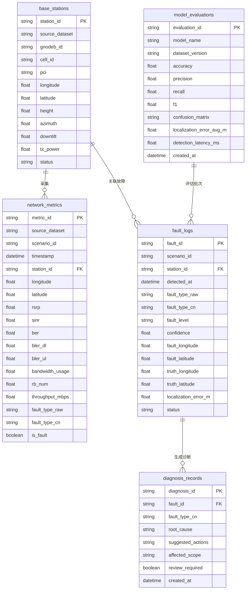
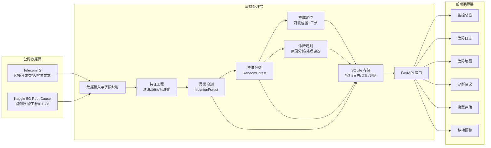
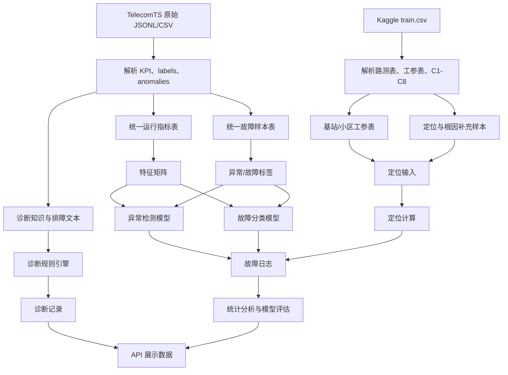

# 阶段一数据与系统方案设计

## 1. 阶段定位

阶段一只完成需求和数据方案设计，不进入数据接入、模型训练、数据库初始化、API 开发或前端实现。

本阶段的正式产物是本文档。本文档用于锁定后续编码、测试、报告和答辩演示的统一口径。

项目第一版采用公网数据优先路线：

```text
公网数据 -> 异常检测 -> 故障分类 -> 故障定位 -> 诊断建议 -> 日志统计与可视化
```

其中：

1. TelecomTS 作为异常检测、故障分类和诊断建议的主数据源。
2. Kaggle 5G Root Cause 数据作为定位、地图展示和根因解释的补充数据源。
3. 系统允许建立统一字段别名和中文故障标签映射。
4. 系统不凭空生成业务采样值，不伪造标签，不伪造模型指标。
5. 公网数据缺失的字段只标注为缺失或后续处理，不作为阶段一正式数据。

此前提前生成的 `backend/data/processed/`、`backend/saved_models/` 和 `backend/reports/model_evaluation.json` 属于预研产物。阶段一文档可参考其可行性，但不将其作为正式交付物；后续进入阶段二时应按本文档重新确认数据接入口径，并清理或重建预研产物。

## 2. 数据源方案

### 2.1 TelecomTS

TelecomTS 是第一版系统的主数据源，主要用于异常检测、故障分类和诊断建议。

可用内容：

| 类型 | 原始字段或结构 | 用途 |
| --- | --- | --- |
| 时间范围 | `start_time`、`end_time`、`sampling_rate` | 构造样本时间窗口和采样频率 |
| KPI 指标 | `KPIs` | 异常检测和故障分类特征 |
| 统计指标 | `statistics` | 构造均值、方差、趋势等特征 |
| 上下文标签 | `labels.zone`、`labels.application`、`labels.mobility`、`labels.congestion`、`labels.anomaly_present` | 场景筛选、页面展示和模型标签 |
| 故障标签 | `anomalies.exists`、`anomalies.type` | 异常检测标签和故障分类标签 |
| 故障区间 | `anomalies.anomaly_duration` | 展示异常发生范围 |
| 影响指标 | `anomalies.affected_kpis` | 解释故障与通信指标的关系 |
| 排障建议 | `anomalies.troubleshooting_tickets` | 诊断建议和报告素材 |
| 文本说明 | `description`、`QnA` | 报告说明和可解释性材料 |

TelecomTS 关键 KPI 与系统字段映射：

| TelecomTS 字段 | 系统统一字段 | 含义 |
| --- | --- | --- |
| `RSRP` | `rsrp` / `signal_strength` | 参考信号接收功率 |
| `UL_SNR` | `sinr` | 上行信噪比或近似信道质量 |
| `DL_BLER`、`UL_BLER` | `ber` / `block_error_rate` | 下行、上行误块率，可作为误码质量指标 |
| `PRB_Utilization_DL`、`PRB_Utilization_UL` | `bandwidth_usage` | 下行、上行 PRB 资源占用 |
| `TX_Bytes`、`RX_Bytes` | `traffic_bytes` / `throughput_proxy` | 发送、接收字节量 |
| `DL_MCS`、`UL_MCS` | `mcs` | 调制编码等级 |
| `UL_NPRB`、`PRBs_DL_Current`、`PRBs_UL_Current` | `prb_count` | 资源块数量 |
| `UL_NumberOfPackets`、`DL_NumberOfPackets` | `packet_count` | 上下行包数量 |

TelecomTS 缺失或不足：

1. 不直接提供真实基站工程参数表。
2. 不直接提供统一经纬度坐标和真实故障位置。
3. 不直接提供设备温度、CPU 负载等硬件状态字段。
4. BLER 不是 BER，但可作为链路误码质量的近似指标用于课程解释。

### 2.2 Kaggle 5G Root Cause

Kaggle 5G Root Cause 数据作为补充数据源，主要用于定位、地图展示和根因解释。

可用内容：

| 类型 | 原始字段或结构 | 用途 |
| --- | --- | --- |
| 样本 ID | `ID` | 场景编号 |
| 根因标签 | `answer`，取值 `C1` 至 `C8` | 根因解释和中文故障类型映射 |
| 路测数据 | `question` 内嵌用户面路测表 | 位置、信号、吞吐、邻区信息 |
| 工参数据 | `question` 内嵌工程参数表 | 基站/小区位置、PCI、方位角、下倾角、高度、功率 |

Kaggle 路测字段与系统字段映射：

| Kaggle 字段 | 系统统一字段 | 含义 |
| --- | --- | --- |
| `Timestamp` | `timestamp` | 路测采样时间 |
| `Longitude`、`Latitude` | `longitude`、`latitude` | 终端或采样点经纬度 |
| `GPS Speed (km/h)` | `gps_speed_kmh` | 测试车辆速度 |
| `5G KPI PCell RF Serving PCI` | `serving_pci` | 服务小区 PCI |
| `5G KPI PCell RF Serving SS-RSRP [dBm]` | `rsrp` | 服务小区信号强度 |
| `5G KPI PCell RF Serving SS-SINR [dB]` | `sinr` | 服务小区信干噪比 |
| `5G KPI PCell Layer2 MAC DL Throughput [Mbps]` | `throughput_mbps` | 下行吞吐量 |
| `5G KPI PCell Layer1 DL RB Num (Including 0)` | `rb_num` | 下行调度 RB 数 |
| 邻区 PCI 和邻区 RSRP 字段 | `neighbor_pci_*`、`neighbor_rsrp_*` | 邻区干扰、重叠覆盖和切换分析 |

Kaggle 工参字段与系统字段映射：

| Kaggle 字段 | 系统统一字段 | 含义 |
| --- | --- | --- |
| `gNodeB ID` | `gnodeb_id` | 基站编号 |
| `Cell ID` | `cell_id` | 小区编号 |
| `Longitude`、`Latitude` | `station_longitude`、`station_latitude` | 小区经纬度 |
| `Mechanical Azimuth` | `azimuth` | 机械方位角 |
| `Mechanical Downtilt`、`Digital Tilt` | `downtilt` | 下倾角 |
| `Height` | `height` | 天线高度 |
| `PCI` | `pci` | 物理小区标识 |
| `Max Transmit Power` | `tx_power` | 最大发射功率 |

Kaggle 缺失或不足：

1. 不作为第一版主分类训练标签，避免与 TelecomTS 的主故障标签体系混杂。
2. 不直接提供完整时序故障日志，只提供场景级根因标签。
3. 不直接提供诊断建议文本，需要依据 C1-C8 根因做规则解释。

## 3. 故障类型与标签映射

第一版保留 5 类中文故障类型：

| 中文故障类型 | 课程含义 | 主要指标表现 |
| --- | --- | --- |
| 信号中断/覆盖退化 | 信号弱覆盖、越区覆盖、连接质量显著下降 | RSRP 下降、SINR 下降、吞吐下降、丢包或误块升高 |
| 误码过高 | 链路误码或误块率过高 | BER/BLER 升高、SINR 降低、重传或吞吐下降 |
| 带宽不足 | 资源拥塞或调度资源不足 | PRB/RB 使用异常、吞吐下降、时延可能升高 |
| 基站故障 | 天线、射频、切换算法或小区设备异常 | 多项 KPI 同时恶化、服务小区异常、切换异常 |
| 信道干扰 | 同频干扰、阻塞、频偏或外部干扰 | SINR 下降、BLER 升高、RSRP/SNR 异常波动 |

### 3.1 TelecomTS 标签映射

| TelecomTS 原生标签 | 中文故障类型 | 映射依据 |
| --- | --- | --- |
| `Jamming` | 信道干扰 | 外部干扰源破坏无线信道质量 |
| `Co-Channel Interference` | 信道干扰 | 同频干扰导致信号质量下降 |
| `Doppler Shift` | 信道干扰 | 频移影响链路质量和解调稳定性 |
| `High Network Congestion` | 带宽不足 | 网络拥塞导致资源占用升高和吞吐下降 |
| `Buffer Overflow` | 带宽不足 | 缓冲积压反映资源或流量处理能力不足 |
| `Resource Allocation Bugs` | 带宽不足 | 资源分配异常影响可用带宽和吞吐 |
| `Faulty RF Filters` | 误码过高 | 射频滤波问题可能导致误块率和链路质量恶化 |
| `Antenna Failure` | 基站故障 | 天线故障属于基站侧硬件异常 |
| `Faulty Handover Algorithm` | 基站故障 | 切换算法异常属于网络侧控制或小区配置故障 |

TelecomTS 中未直接覆盖“信号中断/覆盖退化”作为主分类标签。第一版由 Kaggle C1/C2 支撑该类的根因解释和地图演示；报告中应明确说明该类不是 TelecomTS 主分类训练标签。

### 3.2 Kaggle C1-C8 标签映射

| Kaggle 标签 | 原生含义 | 中文故障类型 | 第一版用途 |
| --- | --- | --- | --- |
| `C1` | 服务小区下倾角过大，远端弱覆盖 | 信号中断/覆盖退化 | 覆盖类根因、地图和定位解释 |
| `C2` | 服务小区覆盖距离超过 1 km，越区覆盖 | 信号中断/覆盖退化 | 覆盖类根因、地图和定位解释 |
| `C3` | 邻区提供更高吞吐 | 信道干扰 | 邻区竞争或覆盖关系解释 |
| `C4` | 非共站同频邻区导致严重重叠覆盖 | 信道干扰 | 同频重叠覆盖和地图解释 |
| `C5` | 频繁切换降低性能 | 基站故障 | 切换异常、网络侧控制问题解释 |
| `C6` | 邻区和服务小区 PCI mod 30 相同导致干扰 | 信道干扰 | PCI 冲突和干扰解释 |
| `C7` | 车速超过 40 km/h 影响吞吐 | 信号中断/覆盖退化 | 移动性导致覆盖/吞吐退化解释 |
| `C8` | 平均调度 RB 低于 160 影响吞吐 | 带宽不足 | 调度资源不足解释 |

Kaggle C1-C8 暂不作为第一版主分类训练标签，只用于定位、根因说明、地图展示和报告补充。

## 4. 统一字段草案

统一字段用于后续数据库、API、前端页面和报告图表。字段可以来自原始字段映射，但不应伪造原始数据不存在的业务值。

### 4.1 运行指标字段

| 字段 | 类型 | 来源 | 说明 |
| --- | --- | --- | --- |
| `metric_id` | string | 系统生成 ID | 指标记录编号 |
| `source_dataset` | string | 系统记录 | `TelecomTS` 或 `Kaggle5GRootCause` |
| `scenario_id` | string | 原始样本或文件 | 场景编号 |
| `timestamp` | datetime/string | 原始数据 | 采样时间 |
| `station_id` | string | 原始或映射 | 基站/小区编号 |
| `cell_id` | string | Kaggle 工参 | 小区编号 |
| `longitude`、`latitude` | float | Kaggle 路测或工参 | 采样点或基站位置 |
| `rsrp` | float | TelecomTS/Kaggle | 信号强度 |
| `sinr` | float | TelecomTS/Kaggle | 信干噪比或近似链路质量 |
| `ber` | float | 映射字段 | TelecomTS 可由 BLER 近似，字段说明必须注明 |
| `bler_dl`、`bler_ul` | float | TelecomTS | 下行、上行误块率 |
| `bandwidth_usage` | float | TelecomTS | PRB 利用率或资源占用 |
| `rb_num` | float | Kaggle | 调度 RB 数 |
| `throughput_mbps` | float | Kaggle | 下行吞吐量 |
| `traffic_bytes` | float | TelecomTS | TX/RX 字节量 |
| `packet_count` | float | TelecomTS | 上下行包数量 |
| `fault_type_raw` | string | 原生标签 | 原始故障类型 |
| `fault_type_cn` | string | 标签映射 | 中文故障类别 |
| `is_fault` | int/bool | 原始标签 | 是否异常或故障 |

### 4.2 故障样本字段

| 字段 | 类型 | 来源 | 说明 |
| --- | --- | --- | --- |
| `fault_id` | string | 系统生成 ID | 故障记录编号 |
| `source_dataset` | string | 系统记录 | 数据来源 |
| `scenario_id` | string | 原始样本 | 场景编号 |
| `fault_type_raw` | string | 原始标签 | 原生故障或根因 |
| `fault_type_cn` | string | 标签映射 | 中文故障类别 |
| `fault_level` | string | 规则映射 | 正常、预警、一般、严重 |
| `affected_kpis` | string/list | TelecomTS | 受影响指标 |
| `start_time`、`end_time` | datetime/string | 原始数据 | 故障窗口 |
| `station_id` | string | 原始或映射 | 相关基站/小区 |
| `fault_longitude`、`fault_latitude` | float | Kaggle 或后续定位结果 | 故障位置 |
| `truth_longitude`、`truth_latitude` | float | Kaggle 工参或原始真值 | 定位误差参考点 |
| `localization_error_m` | float | 后续计算 | 定位误差，单位米 |
| `diagnosis_text` | string | TelecomTS 或规则 | 诊断建议 |

### 4.3 缺失字段处理原则

| 字段 | 当前状态 | 阶段一处理 |
| --- | --- | --- |
| 设备温度、CPU 负载、电源状态 | 公网主数据未稳定提供 | 标注缺失，不在阶段一伪造 |
| 真实故障经纬度 | TelecomTS 不直接提供 | Kaggle 工参与路测数据用于定位补充 |
| BER | TelecomTS 提供 BLER，不是 BER | 字段映射时注明为 BLER 近似链路误码质量 |
| 时延 | 当前主数据未稳定提供 | 标注缺失，后续如需要可从其他数据源或规则补充 |
| 信号中断原生标签 | TelecomTS 未直接提供 | 使用“信号中断/覆盖退化”标签，并由 Kaggle C1/C2/C7 支撑 |

## 5. 数据库草案

数据库采用 SQLite。API 路由不得直接拼接 SQL，应通过 repository 层访问。

数据库 E-R 图草案：



### 5.1 `base_stations`

保存基站和小区基础信息。

| 字段 | 说明 |
| --- | --- |
| `station_id` | 基站或小区唯一编号 |
| `source_dataset` | 数据来源 |
| `gnodeb_id` | gNodeB 编号 |
| `cell_id` | 小区编号 |
| `pci` | PCI |
| `longitude`、`latitude` | 经纬度 |
| `height` | 天线高度 |
| `azimuth` | 方位角 |
| `downtilt` | 下倾角 |
| `tx_power` | 发射功率 |
| `status` | 当前状态 |

### 5.2 `network_metrics`

保存运行指标采样记录。

| 字段 | 说明 |
| --- | --- |
| `metric_id` | 指标记录编号 |
| `source_dataset` | 数据来源 |
| `scenario_id` | 场景编号 |
| `timestamp` | 采样时间 |
| `station_id` | 基站或小区编号 |
| `longitude`、`latitude` | 采样点位置 |
| `rsrp`、`sinr`、`ber`、`bler_dl`、`bler_ul` | 链路质量指标 |
| `bandwidth_usage`、`rb_num`、`throughput_mbps` | 资源和吞吐指标 |
| `fault_type_raw`、`fault_type_cn`、`is_fault` | 故障标签 |

### 5.3 `fault_logs`

保存故障检测、分类和定位结果。

| 字段 | 说明 |
| --- | --- |
| `fault_id` | 故障记录编号 |
| `scenario_id` | 场景编号 |
| `station_id` | 相关基站或小区 |
| `detected_at` | 检测时间 |
| `fault_type_raw` | 原生故障标签 |
| `fault_type_cn` | 中文故障类别 |
| `fault_level` | 故障等级 |
| `confidence` | 分类置信度 |
| `fault_longitude`、`fault_latitude` | 预测故障位置 |
| `truth_longitude`、`truth_latitude` | 参考真值位置 |
| `localization_error_m` | 定位误差 |
| `status` | 未处理、处理中、已处理、需复核 |

### 5.4 `diagnosis_records`

保存诊断建议。

| 字段 | 说明 |
| --- | --- |
| `diagnosis_id` | 诊断记录编号 |
| `fault_id` | 对应故障 |
| `fault_type_cn` | 中文故障类别 |
| `root_cause` | 原因分析 |
| `suggested_actions` | 推荐处理动作 |
| `affected_scope` | 影响范围 |
| `review_required` | 是否需要人工复核 |
| `created_at` | 生成时间 |

### 5.5 `model_evaluations`

保存模型评估结果。

| 字段 | 说明 |
| --- | --- |
| `evaluation_id` | 评估编号 |
| `model_name` | 模型名称 |
| `dataset_version` | 数据版本 |
| `accuracy`、`precision`、`recall`、`f1` | 基础指标 |
| `confusion_matrix` | 混淆矩阵 JSON |
| `localization_error_avg_m` | 平均定位误差 |
| `detection_latency_ms` | 检测耗时 |
| `created_at` | 评估时间 |

## 6. 模块划分

系统模块图草案：



数据流图草案：



| 模块 | 职责 | 第一版数据来源 |
| --- | --- | --- |
| 数据接入 | 读取 TelecomTS 和 Kaggle 原始文件，输出统一中间表 | TelecomTS、Kaggle |
| 特征工程 | 缺失值处理、标准化、类别编码、训练/测试划分 | TelecomTS 主体，Kaggle 补充 |
| 异常检测 | 判断正常或异常 | TelecomTS `anomaly_present` |
| 故障分类 | 识别中文故障类型 | TelecomTS `anomalies.type` 映射为主 |
| 故障定位 | 估计故障或问题小区位置，计算定位误差 | Kaggle 路测和工参 |
| 诊断规则 | 输出原因分析、处理建议、人工复核标志 | TelecomTS 排障文本 + C1-C8 规则 |
| 数据库 | 保存基站、指标、故障日志、诊断记录、模型评估 | 统一中间表 |
| API | 向前端提供统一 JSON 接口 | SQLite + 模型结果 |
| 前端展示 | 总览、日志、地图、诊断、模型评估、移动预警 | FastAPI |

## 7. 演示故事线

答辩演示按以下顺序组织：

```text
展示正常网络状态
-> 加载或触发公网故障场景
-> 系统检测到异常
-> 显示中文故障类型
-> 在地图上显示相关基站、小区或路测位置
-> 展示定位误差或问题区域
-> 给出诊断建议和处理动作
-> 查看历史故障日志和统计图
-> 展示模型准确率、召回率、F1、混淆矩阵和检测耗时
```

该故事线需要证明：

1. 系统能够使用公网数据完成可运行闭环。
2. AI 模型参与异常检测和故障分类。
3. 故障类型与通信 KPI 之间有可解释关系。
4. 地图和定位结果有数据依据。
5. 诊断建议面向运维场景，不只是算法输出。

## 8. 报告和截图清单

阶段一后续应为报告准备以下材料：

| 材料 | 用途 |
| --- | --- |
| 数据源说明表 | 需求分析和数据方案 |
| 故障类型与指标关系表 | 通信专业知识说明 |
| 标签映射表 | AI 分类任务定义 |
| 数据库表草案 | 数据库设计章节 |
| 系统模块图 | 总体设计章节 |
| 业务流程图 | 功能设计章节 |
| 混淆矩阵 | 测试结果和性能分析 |
| 定位误差图 | 故障定位效果分析 |
| 监控总览截图 | 系统实现效果 |
| 故障日志截图 | 日志查询与统计 |
| 故障地图截图 | 定位与可视化 |
| 诊断建议截图 | 运维应用价值 |
| 模型评估截图 | AI 方法效果证明 |

## 9. 风险和后续处理

| 风险 | 影响 | 后续处理 |
| --- | --- | --- |
| TelecomTS 不直接提供基站经纬度 | 地图和定位无法完全依赖 TelecomTS | 使用 Kaggle 工参和路测位置支撑地图与定位 |
| TelecomTS 未直接提供信号中断标签 | 课程措辞与公网标签不完全一致 | 第一版采用“信号中断/覆盖退化”，并在报告中解释 |
| BLER 与 BER 不完全等价 | 误码过高指标解释需谨慎 | 报告中明确 BLER 是链路块错误质量指标 |
| 设备硬件状态字段缺失 | 基站故障解释不能依赖温度和 CPU | 使用 `Antenna Failure`、`Faulty Handover Algorithm` 等网络侧标签解释 |
| Kaggle C1-C8 与 TelecomTS 标签体系不同 | 训练标签混杂可能影响模型解释 | 第一版 Kaggle 只做定位和根因补充，不作为主分类训练标签 |
| 预研产物已存在 | 可能误导后续阶段边界 | 后续阶段二开始前清理或重建预研数据和模型 |

## 10. 阶段一验收标准

阶段一完成时，应满足以下标准：

1. 已明确采用 TelecomTS + Kaggle 5G Root Cause 的公网数据路线。
2. 已明确 TelecomTS 和 Kaggle 各自服务的系统模块。
3. 已固定 5 类中文故障类型和原生标签映射。
4. 已给出统一字段草案和缺失字段处理原则。
5. 已给出 SQLite 数据库表草案。
6. 已给出系统模块划分和演示故事线。
7. 已明确报告和截图素材清单。
8. 已明确公网数据缺陷和后续处理策略。

## 11. 阶段二实施任务清单

阶段二目标是把阶段一确定的数据方案落成可复现的数据与模型闭环。阶段二仍以公网数据为主，不进入前端页面开发；前端和 API 在阶段三、阶段四推进。

### 11.1 预研产物处理

阶段二开始前，应先处理此前提前生成的预研产物：

| 预研产物 | 处理方式 | 原因 |
| --- | --- | --- |
| `backend/data/processed/` | 清理后按阶段一口径重建 | 避免旧字段或标签口径影响正式数据集 |
| `backend/saved_models/` | 清理后重新训练生成 | 模型必须基于正式中间表和固定随机种子 |
| `backend/reports/model_evaluation.json` | 清理后重新评估生成 | 指标必须来自正式训练评估流程 |
| `backend/src/data_ingestion/` 等预研代码 | 复核后决定保留、重写或迁移 | 只保留符合阶段一设计口径的逻辑 |

清理时不得删除原始公网数据目录 `参考文件/datasets/`。

### 11.2 数据接入任务

阶段二的数据接入应产出统一中间表，供模型、数据库和后续 API 使用。

| 任务 | 输入 | 输出 | 验收标准 |
| --- | --- | --- | --- |
| TelecomTS 解析 | `TelecomTS` JSONL/CSV | `network_metrics.csv`、`fault_samples.csv`、`diagnosis_knowledge.csv` | 能解析 KPI、labels、anomalies、affected_kpis、troubleshooting_tickets |
| Kaggle 解析 | `kaggle/train.csv` | `base_stations.csv`、`location_samples.csv`、`root_cause_samples.csv` | 能解析路测表、工参表、C1-C8 标签 |
| 标签映射 | 原生故障标签 | `fault_type_raw`、`fault_type_cn` | 5 类中文故障映射完整，未覆盖标签需记录 |
| 字段标准化 | 原始字段 | 统一字段表 | 字段名、类型、来源、缺失策略与本文档一致 |
| 数据版本记录 | 原始文件与输出文件 | `dataset_manifest.json` | 记录数据源、行数、标签分布、生成时间和处理脚本版本 |

阶段二中间表建议保存到：

```text
backend/data/processed/
```

### 11.3 特征工程任务

| 任务 | 要求 | 验收标准 |
| --- | --- | --- |
| 数值特征整理 | 提取 RSRP、SINR、BLER、PRB/RB、吞吐、字节量等字段 | 特征列稳定，缺失字段有明确处理 |
| 类别特征处理 | 处理数据源、场景、应用类型、移动状态、拥塞状态等字段 | 类别编码不依赖前端输入 |
| 标签构造 | 构造 `is_fault` 和 `fault_type_cn` | 异常检测标签和分类标签可独立使用 |
| 数据划分 | 固定随机种子划分训练、验证、测试集 | 每次运行结果可复现 |
| 特征管道保存 | 保存标准化、编码和缺失处理管道 | 后续推理和 API 可复用同一管道 |

### 11.4 模型训练与评估任务

| 任务 | 推荐方案 | 输出 |
| --- | --- | --- |
| 异常检测 | IsolationForest | `anomaly_detector.joblib`、accuracy、precision、recall、F1 |
| 故障分类 | RandomForestClassifier | `fault_classifier.joblib`、accuracy、macro-F1、混淆矩阵 |
| 故障定位 | Kaggle 路测位置 + 工参位置的简化定位 | 平均定位误差、定位误差分布 |
| 诊断建议 | TelecomTS 排障文本 + C1-C8 规则 | 诊断知识表和规则说明 |
| 评估报告 | JSON + 图表 | `model_evaluation.json`、混淆矩阵图、定位误差图 |

模型文件统一保存到：

```text
backend/saved_models/
```

评估结果和报告图表保存到：

```text
backend/reports/
backend/reports/figures/
```

### 11.5 阶段二验收标准

阶段二完成时，应满足：

1. 正式中间表由脚本可重复生成。
2. 数据量不少于 3000 条运行指标记录。
3. 中文故障类型不少于 4 类，第一版目标为 5 类。
4. TelecomTS 主数据能支撑异常检测和故障分类。
5. Kaggle 补充数据能支撑基站/小区位置、地图和定位误差分析。
6. 模型训练脚本支持固定随机种子。
7. 输出准确率、召回率、F1、混淆矩阵、定位误差和检测耗时。
8. 所有指标来自真实运行结果，不手工伪造。

## 12. 统一字段字典

字段字典用于约束阶段二中间表、SQLite 表结构、API 响应和前端展示。字段是否必填按第一版闭环最低要求定义。

### 12.1 通用字段

| 字段 | 类型 | 必填 | 来源 | 用途 | 缺失处理 |
| --- | --- | --- | --- | --- | --- |
| `source_dataset` | string | 是 | 系统记录 | 区分 TelecomTS 和 Kaggle | 不允许缺失 |
| `scenario_id` | string | 是 | 原始文件路径、样本 ID | 场景追踪、日志关联 | 不允许缺失 |
| `timestamp` | datetime/string | 否 | TelecomTS / Kaggle | 趋势展示、日志时间 | 缺失时保留空值 |
| `station_id` | string | 否 | Kaggle 工参或系统映射 | 基站关联、地图展示 | TelecomTS 无真实基站时可为空或用场景映射 ID |
| `cell_id` | string | 否 | Kaggle 工参 | 小区关联 | 缺失时保留空值 |
| `longitude` | float | 否 | Kaggle 路测或工参 | 地图展示、定位 | TelecomTS 缺失时不伪造 |
| `latitude` | float | 否 | Kaggle 路测或工参 | 地图展示、定位 | TelecomTS 缺失时不伪造 |

### 12.2 通信 KPI 字段

| 字段 | 类型 | 必填 | 来源 | 用途 | 缺失处理 |
| --- | --- | --- | --- | --- | --- |
| `rsrp` | float | 是 | TelecomTS `RSRP` / Kaggle RSRP | 信号强度、覆盖分析 | 缺失样本不用于依赖 RSRP 的分析 |
| `sinr` | float | 是 | TelecomTS `UL_SNR` / Kaggle SINR | 信道质量、干扰分析 | 缺失样本不用于依赖 SINR 的分析 |
| `ber` | float | 否 | TelecomTS BLER 映射 | 误码质量展示 | 标注为 BLER 近似，不伪造 BER |
| `bler_dl` | float | 否 | TelecomTS `DL_BLER` | 下行误块率 | 缺失时为空 |
| `bler_ul` | float | 否 | TelecomTS `UL_BLER` | 上行误块率 | 缺失时为空 |
| `bandwidth_usage` | float | 否 | TelecomTS PRB 利用率 | 带宽不足分析 | Kaggle 缺失时使用 `rb_num` 单独分析 |
| `rb_num` | float | 否 | Kaggle RB Num | 调度资源分析 | TelecomTS 缺失时使用 PRB 字段 |
| `throughput_mbps` | float | 否 | Kaggle throughput | 吞吐能力分析 | TelecomTS 可保留空值或仅使用字节量代理 |
| `traffic_bytes` | float | 否 | TelecomTS `TX_Bytes` / `RX_Bytes` | 流量强度分析 | Kaggle 缺失时保留空值 |
| `packet_count` | float | 否 | TelecomTS packet 字段 | 包数量和流量分析 | Kaggle 缺失时保留空值 |
| `mcs` | float | 否 | TelecomTS `DL_MCS` / `UL_MCS` | 调制编码状态分析 | 缺失时保留空值 |

### 12.3 标签与故障字段

| 字段 | 类型 | 必填 | 来源 | 用途 | 缺失处理 |
| --- | --- | --- | --- | --- | --- |
| `is_fault` | bool/int | 是 | TelecomTS `anomaly_present` / Kaggle 场景根因 | 异常检测标签 | TelecomTS 正常样本为 0，异常样本为 1 |
| `fault_type_raw` | string | 是 | TelecomTS `anomalies.type` / Kaggle `answer` | 原生标签追踪 | 正常样本填 `Normal` |
| `fault_type_cn` | string | 是 | 标签映射 | 中文故障分类 | 未覆盖标签填 `未分类故障` 并记录 |
| `fault_level` | string | 否 | 规则映射 | 告警等级展示 | 缺失时由规则在后续阶段生成 |
| `affected_kpis` | string/list | 否 | TelecomTS `affected_kpis` | 解释故障影响指标 | Kaggle 缺失时依据根因规则解释 |
| `confidence` | float | 否 | 分类模型输出 | 人工复核判断 | 模型训练前为空 |
| `status` | string | 否 | 系统处理状态 | 故障日志流转 | 默认可在后端阶段定义 |

### 12.4 定位与诊断字段

| 字段 | 类型 | 必填 | 来源 | 用途 | 缺失处理 |
| --- | --- | --- | --- | --- | --- |
| `fault_longitude` | float | 否 | 定位计算 | 故障地图 | 定位未计算前为空 |
| `fault_latitude` | float | 否 | 定位计算 | 故障地图 | 定位未计算前为空 |
| `truth_longitude` | float | 否 | Kaggle 工参或参考位置 | 定位误差计算 | 没有参考点时不计算误差 |
| `truth_latitude` | float | 否 | Kaggle 工参或参考位置 | 定位误差计算 | 没有参考点时不计算误差 |
| `localization_error_m` | float | 否 | 定位计算 | 性能分析 | 没有真值时为空 |
| `root_cause` | string | 否 | TelecomTS 排障文本 / C1-C8 规则 | 诊断解释 | 缺失时由规则生成 |
| `suggested_actions` | string | 否 | TelecomTS 排障文本 / 规则引擎 | 运维建议 | 缺失时进入人工复核 |
| `review_required` | bool | 否 | 规则或模型置信度 | 人工复核提示 | 默认后端规则生成 |

### 12.5 模型评估字段

| 字段 | 类型 | 必填 | 来源 | 用途 | 缺失处理 |
| --- | --- | --- | --- | --- | --- |
| `model_name` | string | 是 | 训练脚本 | 区分异常检测、故障分类、定位模型 | 不允许缺失 |
| `dataset_version` | string | 是 | 数据 manifest | 保证指标可追溯 | 不允许缺失 |
| `accuracy` | float | 是 | 评估脚本 | 准确率展示 | 不手工填写 |
| `precision` | float | 是 | 评估脚本 | 精确率展示 | 不手工填写 |
| `recall` | float | 是 | 评估脚本 | 召回率展示 | 不手工填写 |
| `f1` | float | 是 | 评估脚本 | F1 展示 | 不手工填写 |
| `confusion_matrix` | JSON/string | 否 | 分类评估脚本 | 混淆矩阵图 | 分类模型评估后生成 |
| `localization_error_avg_m` | float | 否 | 定位评估脚本 | 定位误差分析 | 定位评估后生成 |
| `detection_latency_ms` | float | 否 | 评估脚本 | 性能分析 | 评估时记录 |
