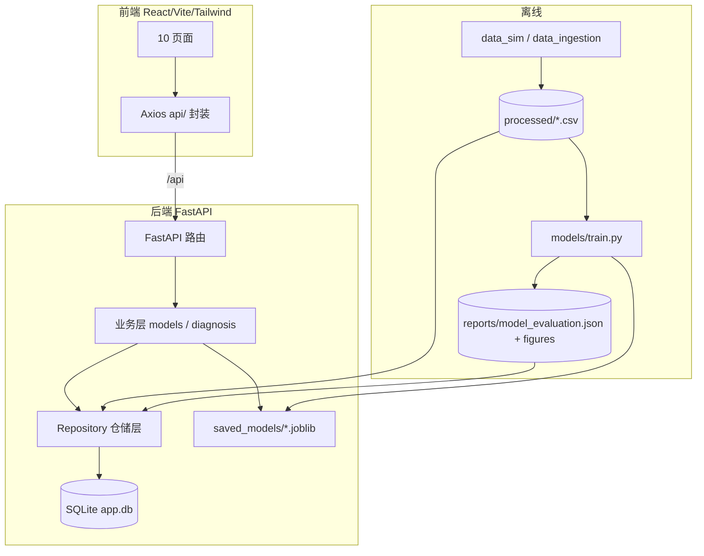
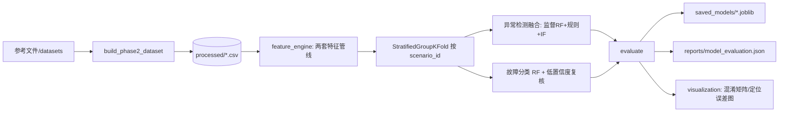
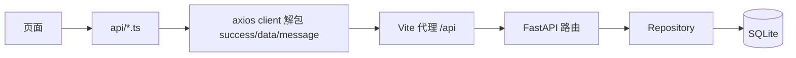
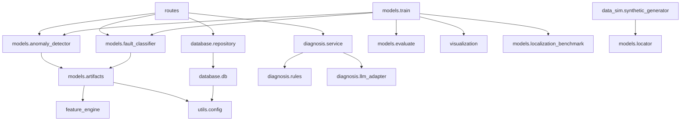
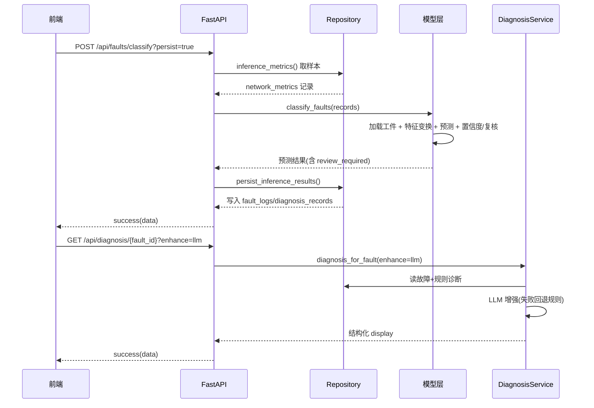

# 系统架构与数据流

> 本文档描述系统总体架构、五条核心数据链路、模块依赖方向与关键时序，供课程报告
> "总体设计/功能设计（流程图、时序图）"章节引用。组件细节见
> [`model_layer_and_detection.md`](./model_layer_and_detection.md)、
> [`diagnosis_subsystem.md`](./diagnosis_subsystem.md)、[`database_schema.md`](./database_schema.md)、
> [`api_reference.md`](./api_reference.md)。

## 1. 总体架构

前后端分离 + 离线建模 + 运行态 SQLite。



路径统一由 `backend/src/utils/config.py` 提供。

## 2. 五条核心链路

### 2.1 离线建模链路



定位主指标单独由 `localization_benchmark` 在合成真值场景评估（见模型层文档）。

### 2.2 数据入库链路（三入口 → SQLite）

```mermaid
flowchart LR
    R1[/api/simulation/run] --> RD[demo_loader.refresh_demo_database]
    R2[/api/simulation/generate*] --> GEN[synthetic_generator] --> RD
    R3[/api/simulation/import] --> IMP[external_importer]
    RD --> INIT[init_db.initialize_database]
    INIT --> DB[(SQLite 五表)]
    IMP --> DB
    IMP --> BATCH[(data_import_batches/errors)]
```

预览模式生成的数据经 `/api/simulation/commit-preview` 再写库。

### 2.3 在线推理链路

```mermaid
flowchart LR
    REQ[/api/faults/detect or classify] --> RM[Repository.inference_metrics]
    RM --> DBq[(network_metrics)]
    REQ --> INF[detect_anomalies / classify_faults]
    INF --> ARTq[load_model_artifacts]
    INF --> OUT[预测+置信度/异常分数+复核标记]
    OUT -- persist=True --> PERSIST[Repository.persist_inference_results]
    PERSIST --> DBw[(fault_logs + diagnosis_records)]
```

### 2.4 诊断链路

```mermaid
flowchart LR
    DREQ[/api/diagnosis/id] --> SVC[DiagnosisService]
    SVC --> RREAD[Repository.diagnosis_for_fault]
    RREAD --> RULE[rules.build_diagnosis_display 规则兜底]
    SVC -- enhance=llm / POST enhance --> LLM[llm_adapter.complete_json]
    LLM -- 成功 --> MERGE[合并进 display]
    LLM -- 失败/未配置 --> RULE
```

### 2.5 前端展示链路



## 3. 模块依赖方向（无环）



要点：路径单一来源 `utils.config`；指标/绘图/定位已与训练脚本解耦；`data_sim` 依赖
`models.locator`（定位几何），无反向依赖，故无环。

## 4. 关键时序：一次"检测→分类→诊断"



## 5. 一句话总结

原始数据→构建 processed→离线训练出模型与评估图 → 三种方式把数据灌进 SQLite →
运行时从库取样做检测/分类并回写故障 → 规则(+可选 LLM)生成诊断 → React 各页面经
`/api` 统一读展。
