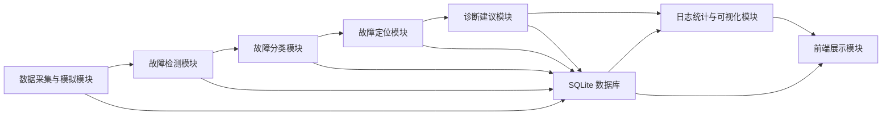

# 系统功能模块结构说明

## 1. 文档用途

本文档从课程设计报告和答辩展示角度梳理“基于AI的智能通信故障检测与诊断系统”的功能结构。该结构优先服务于论文中的需求分析、总体设计、功能模块图和详细设计章节。

系统结构不直接按前端、后端、数据库等技术层划分，而是按题目5要求的业务闭环划分为若干功能模块。技术层是实现手段，功能模块是论文和验收时更容易理解的系统能力。

系统主线如下：

```text
通信网络数据 -> 异常检测 -> 故障分类 -> 故障定位 -> 诊断建议 -> 日志统计与可视化 -> 前端展示
```

## 2. 总体功能结构

系统面向通信网络运维场景，围绕基站运行指标、无线链路质量、故障类型和诊断建议形成闭环。总体功能模块可划分为七个部分：

```text
基于AI的智能通信故障检测与诊断系统
├─ 1. 数据采集与模拟模块
├─ 2. 故障检测模块
├─ 3. 故障分类模块
├─ 4. 故障定位模块
├─ 5. 诊断建议模块
├─ 6. 日志统计与可视化模块
└─ 7. 前端展示模块
```

对应的数据流关系如下：



## 3. 功能模块说明

### 3.1 数据采集与模拟模块

数据采集与模拟模块负责构建系统运行所需的通信网络数据。课程设计阶段主要采用参考数据集接入和补充模拟的方式，形成统一格式的数据表。

该模块主要处理以下数据：

| 数据类型 | 主要字段 |
| --- | --- |
| 基站数据 | 基站编号、经纬度、PCI、小区编号、发射功率、天线高度、设备状态 |
| 网络运行指标 | 时间戳、RSRP、SINR、BER、带宽占用率、RB数量、吞吐量、流量、包数 |
| 故障样本 | 故障编号、故障类型、严重程度、影响指标、故障位置、真实位置、定位误差 |
| 诊断知识 | 故障类型、根因描述、处理建议、是否需要人工复核 |

该模块的输出结果包括标准化后的网络指标数据、基站数据、故障日志样本和诊断知识库，为后续 AI 检测、故障分类和可视化展示提供数据基础。

### 3.2 故障检测模块

故障检测模块用于判断当前通信网络运行状态是否异常。该模块以网络运行指标为输入，经过特征工程处理后，使用异常检测模型输出“正常/异常”判断。

本系统优先采用 Isolation Forest 作为异常检测方法。该方法适合结构化通信指标数据，训练速度较快，便于课程设计阶段进行模型复现和结果解释。

该模块主要输出：

1. 是否异常。
2. 异常得分。
3. 检测阈值。
4. 检测耗时。
5. 异常检测准确率、召回率和 F1 值。

### 3.3 故障分类模块

故障分类模块用于对异常样本进一步识别故障类型。系统根据 RSRP、SINR、BER、带宽占用率、吞吐量等通信指标特征，判断故障属于哪一类典型通信问题。

本系统优先采用 Random Forest 分类模型。该模型对结构化特征表现稳定，能够输出分类结果和特征贡献解释，适合课程设计报告中说明通信指标与故障类型之间的关系。

系统重点覆盖以下故障类型：

| 故障类型 | 典型指标表现 |
| --- | --- |
| 信号中断/覆盖退化 | RSRP 显著下降，SINR 降低，吞吐量下降 |
| 误码过高 | BER 或 BLER 升高，SINR 降低，链路质量变差 |
| 带宽不足 | 带宽占用率升高，RB 资源紧张，吞吐下降 |
| 基站故障 | 基站相关多项指标同时异常，局部区域服务质量下降 |
| 信道干扰 | SINR 明显下降，误码率升高，吞吐量波动 |

该模块主要输出故障类型、分类置信度、各类别概率、分类准确率和混淆矩阵。

### 3.4 故障定位模块

故障定位模块用于估算故障发生位置，并与真实位置或模拟位置进行对比。系统可根据异常基站位置、终端测量坐标、RSRP/SINR 等信息估算故障坐标。

课程设计阶段可采用简化的加权质心定位或最近基站定位方法，保证能够输出可解释的预测位置和定位误差。

该模块主要输出：

1. 预测故障经纬度。
2. 真实或模拟故障经纬度。
3. 定位误差，单位为米。
4. 平均定位误差。
5. 地图展示所需的坐标数据。

### 3.5 诊断建议模块

诊断建议模块用于根据故障类型、严重程度、影响指标和定位结果生成运维处理建议。该模块采用规则库方式实现，保证结果稳定、可解释，便于答辩演示。

典型诊断规则如下：

| 故障类型 | 诊断建议 |
| --- | --- |
| 信号中断/覆盖退化 | 检查基站供电、传输链路、射频模块和天馈系统 |
| 误码过高 | 检查信道干扰、编码配置、设备老化和链路质量 |
| 带宽不足 | 检查流量拥塞，调整资源分配，优化负载均衡 |
| 基站故障 | 查看设备告警，重启相关服务，必要时切换备用设备 |
| 信道干扰 | 排查干扰源，调整频点，优化发射功率 |

该模块主要输出根因分析、推荐处理动作、影响范围说明和是否需要人工复核。

### 3.6 日志统计与可视化模块

日志统计与可视化模块用于保存故障检测、分类、定位和诊断结果，并为前端页面和课程设计报告提供统计图表。

该模块主要支持：

1. 故障日志查询。
2. 故障详情查看。
3. 按故障类型统计数量和占比。
4. 按严重程度统计告警数量。
5. 展示检测准确率、分类准确率、召回率和 F1 值。
6. 展示故障分类混淆矩阵。
7. 展示定位误差分布。
8. 展示检测耗时。

该模块是系统可测试、可分析、可写入报告的重要支撑。

### 3.7 前端展示模块

前端展示模块面向运维人员提供 PC 端管理界面和移动端预警展示。系统首屏进入监控总览，不设置营销式首页。

前端页面包括：

| 页面 | 作用 |
| --- | --- |
| 监控总览 | 展示基站数量、告警数量、严重故障、模型准确率和趋势图 |
| 基站管理 | 展示基站列表、位置、状态和关键参数 |
| 基站详情 | 展示单个基站工参和近期运行指标 |
| 故障日志 | 查询历史故障，筛选故障类型和严重程度 |
| 故障地图 | 展示基站位置、故障位置和定位误差 |
| 诊断建议 | 展示故障原因、影响范围和处理建议 |
| 模型评估 | 展示准确率、召回率、F1、混淆矩阵和定位误差 |
| 移动预警 | 面向移动端展示严重故障和快速处理建议 |

## 4. 功能模块与技术层映射

每个功能模块会横跨多个技术层。论文中建议先说明功能模块，再在详细设计中说明各模块对应的技术实现。

| 功能模块 | 数据层 | 模型/算法层 | 后端 API 层 | 前端展示层 |
| --- | --- | --- | --- | --- |
| 数据采集与模拟模块 | 数据集、CSV、SQLite | 数据清洗、字段标准化 | 模拟数据接口 | 数据概览 |
| 故障检测模块 | 网络指标表 | Isolation Forest | 检测接口 | 检测结果展示 |
| 故障分类模块 | 故障样本表 | Random Forest | 分类接口 | 故障类型展示 |
| 故障定位模块 | 基站坐标、终端坐标、故障坐标 | 加权质心/最近基站定位 | 故障详情接口 | 地图与误差展示 |
| 诊断建议模块 | 诊断知识库 | 规则引擎 | 诊断建议接口 | 诊断详情页 |
| 日志统计与可视化模块 | 故障日志、模型评估表 | 指标统计 | 统计查询接口 | 图表、表格、混淆矩阵 |
| 前端展示模块 | 后端接口数据 | 前端数据聚合 | API 调用封装 | 管理系统页面 |

## 5. 当前工程实现对应关系

当前源码工程中，功能模块与主要实现文件的对应关系如下：

| 功能模块 | 主要实现位置 |
| --- | --- |
| 数据采集与模拟模块 | `backend/src/data_ingestion/build_phase2_dataset.py` |
| 特征工程 | `backend/src/feature_engine/features.py` |
| 故障检测与分类训练 | `backend/src/models/train_phase2.py` |
| 数据库存储 | `backend/src/database/schema.sql`, `backend/src/database/init_db.py`, `backend/src/database/repository.py` |
| 后端接口 | `backend/src/api/app.py`, `backend/src/api/routes/` |
| 前端展示 | `frontend/src/pages/`, `frontend/src/components/`, `frontend/src/api/` |
| 模型评估结果 | `backend/reports/model_evaluation.json`, `backend/reports/figures/` |

需要注意的是，功能模块结构是论文和系统设计视角，源码目录结构是工程实现视角。两者并不一一对应，一个功能模块通常会同时涉及数据、模型、接口和前端页面。

## 6. 可用于报告的描述

在课程设计报告中，可将系统总体结构描述为：

```text
本系统围绕通信网络故障检测与诊断业务流程进行设计，整体划分为数据采集与模拟、故障检测、故障分类、故障定位、诊断建议、日志统计与可视化、前端展示七个功能模块。数据采集与模拟模块负责构建基站、链路指标和故障样本数据；故障检测模块利用 Isolation Forest 判断网络状态是否异常；故障分类模块利用 Random Forest 识别故障类型；故障定位模块根据基站和终端位置估算故障坐标并计算定位误差；诊断建议模块基于规则库输出根因分析和运维处理建议；日志统计与可视化模块保存故障记录并展示模型性能指标；前端展示模块以管理系统形式展示网络运行状态、故障日志、故障地图、诊断建议和模型评估结果。各模块共同构成从通信网络数据到智能诊断结果展示的完整闭环。
```
